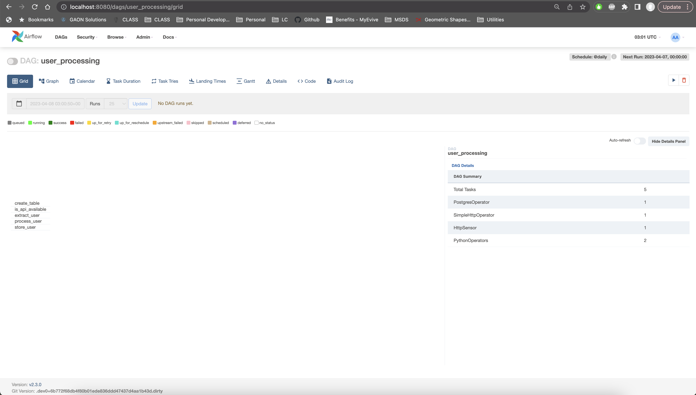
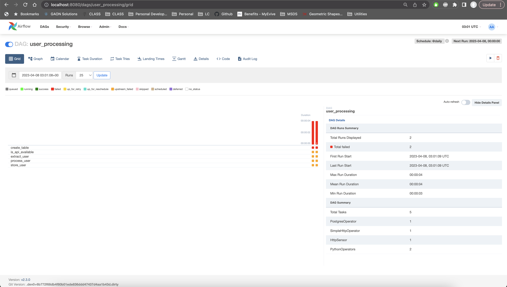
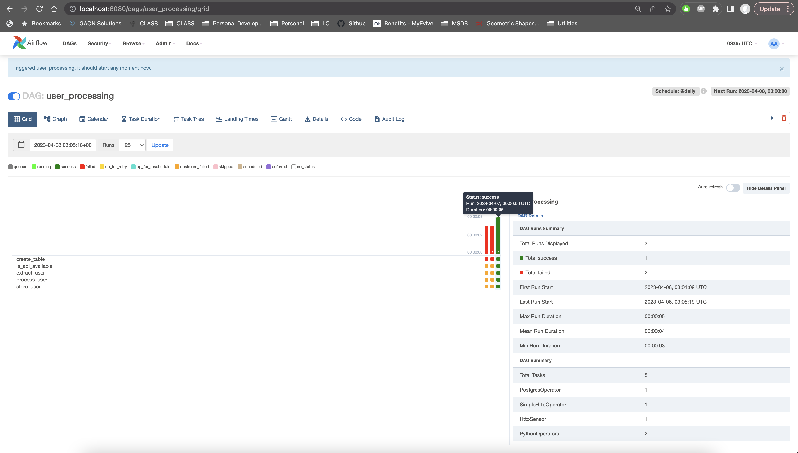

# DS5559_airflow_lab

Please turn in the following.

1.  Screenshot of of the DAG view showing this dag having loaded

    - 

2.  Screenshot after you trigger it and failed showing in the DAG page.  

    - 

3.  Now manually set up the connections mentioned in the lab instructions, steps 1.3, and 1.7.

    - Set up within the UI

4.  Screenshot of the dag triggered again, and it should now show a 'passing' circle too  

    - 

That's it, 3 screenshots.  Please name them loaded, failed, running.